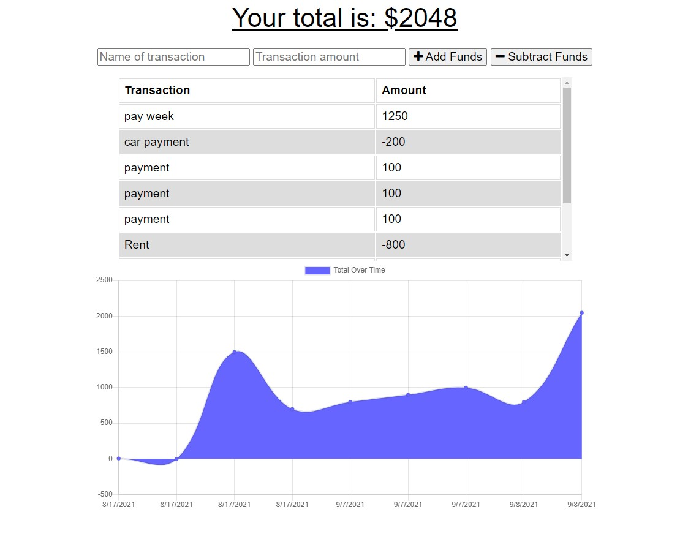

# Online-Offline-Budget-Trackers

## Table of Contents
* [Description](#Description)
* [Technology](#Technology)
* [Screenshot](#Screenshot)
* [Live Site](#Live_Site)
* [License](#License)
* [Contact](#Contact)

## Description
The user will be able to add expenses and deposits to their budget with or without a connection. A user will also be able to download the app since it is a progressive web app. When entering transactions offline, they should populate the total when brought back online. 

## Technology

## Screenshot

## Live Site
## License

## Contact
|  |                 |
| ------ | -----                |
| jkur16 | jamiekuras@gmail.com |